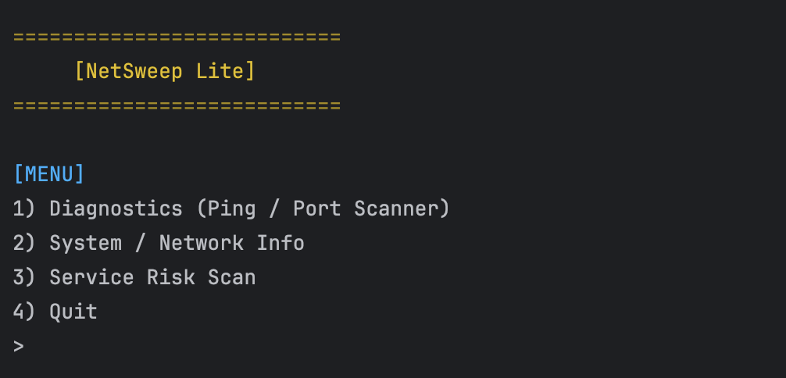
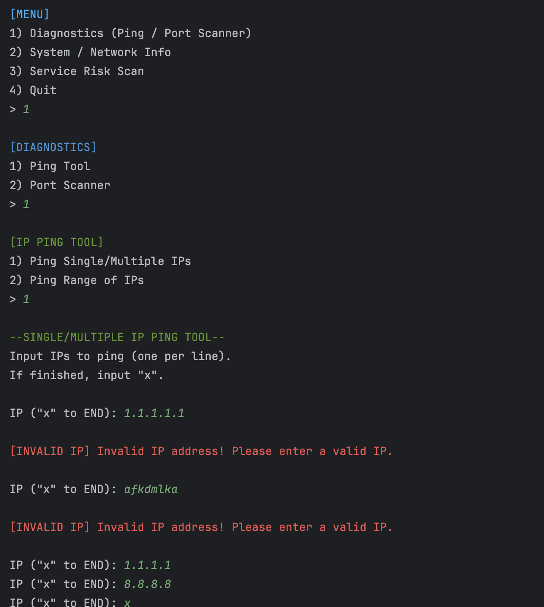
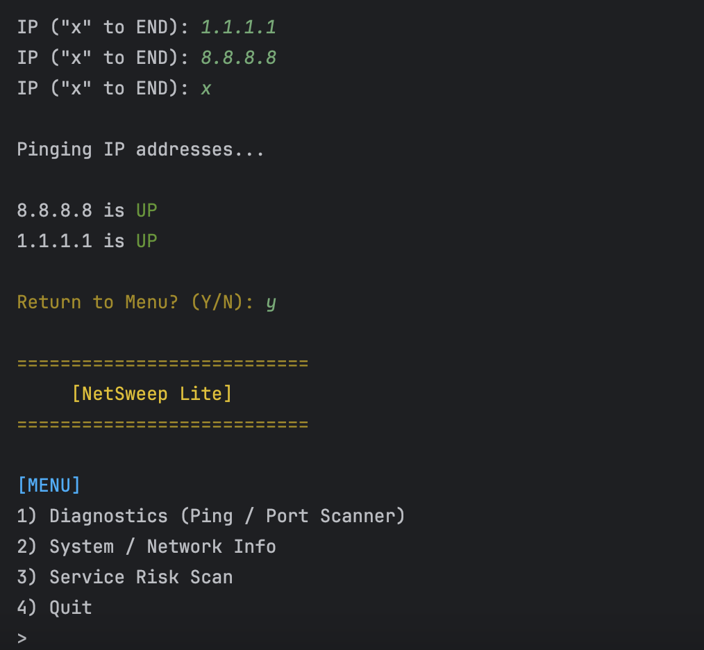
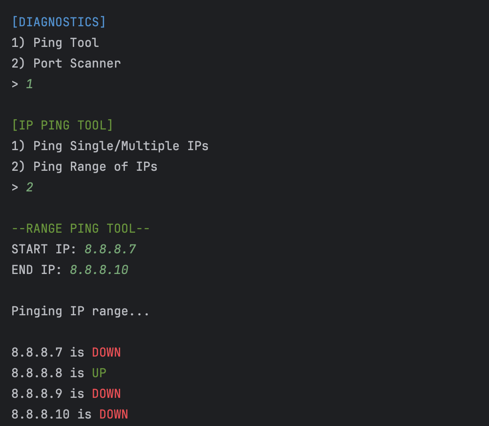
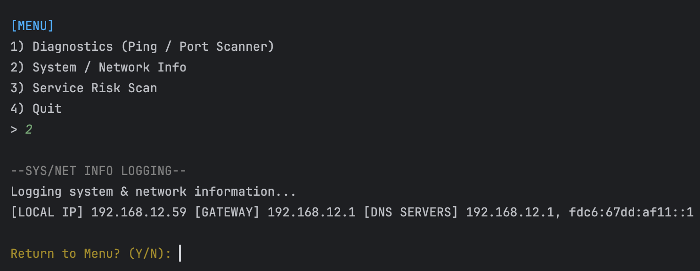
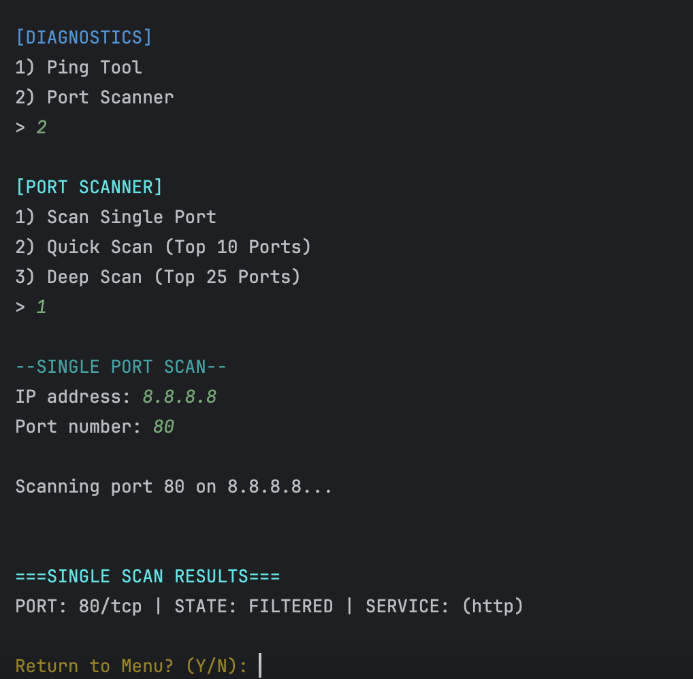
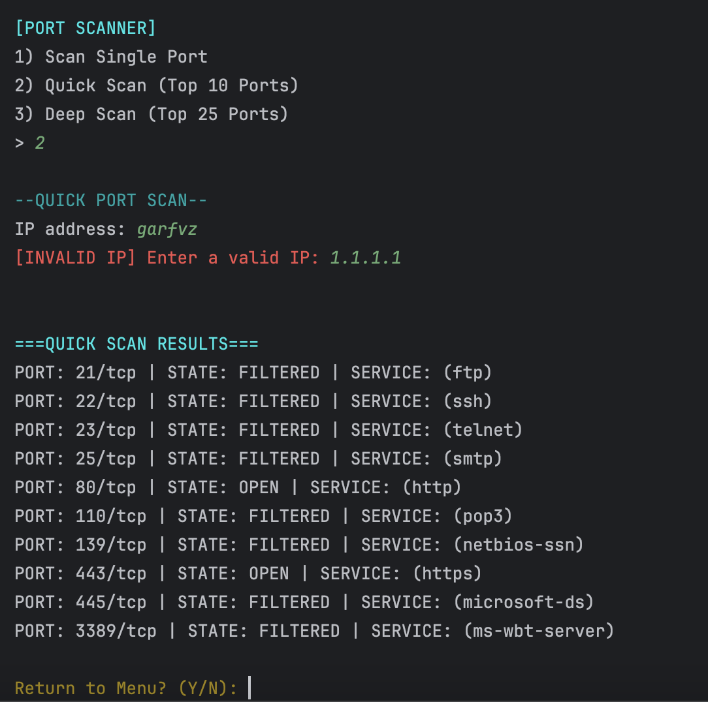
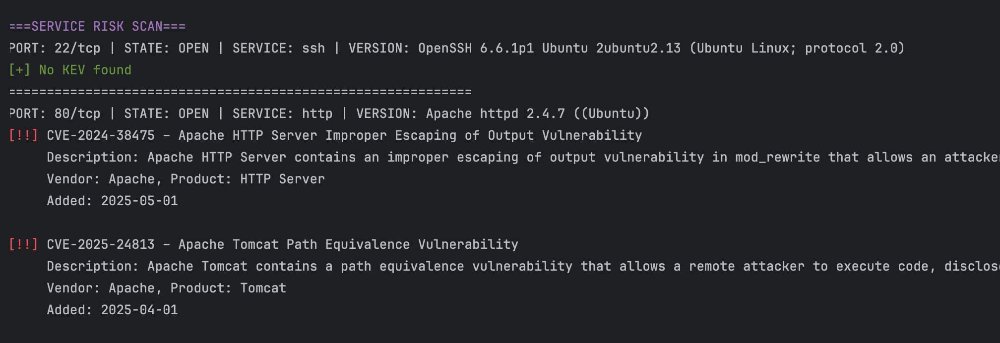
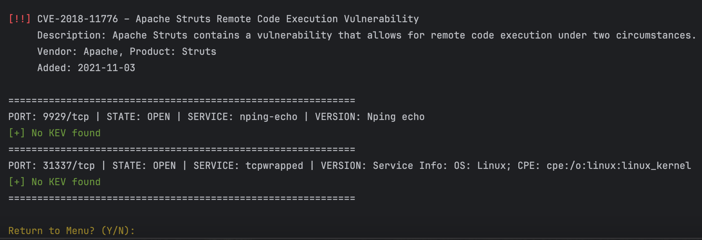

# 🧹 NetSweep Lite

> A modular Python-based network diagnostic and vulnerability triage toolkit for IT, GRC, and Security usage. Built while studying for A+ and ISC2 CC.

---

## ⚡ What is NetSweep Lite?

`NetSweep Lite` is a lightweight CLI tool designed to simplify core network diagnostics and assist in vulnerability detection using **Known Exploited Vulnerabilities (KEV)** data from CISA. Built for speed and clarity, it helps you:

- 🔍 Scan IPs and ports quickly with Nmap integration  
- 📶 Diagnose network connectivity with parallelized IP pinging  
- 📋 Log system/network stats for documentation or audits  
- 🛡️ Identify risks tied to services using a local KEV CSV database  

---

## Features

| Feature                  | Description                                                                 |
|--------------------------|-----------------------------------------------------------------------------|
| 🚀 Concurrent Ping Tool   | Supports single, multiple, or ranged IP pings — fast and logged             |
| 🔍 Nmap Port Scanning     | Quick or deep port scans with friendly, color-coded output                 |
| 🛡️ KEV Matching Engine    | Maps services from Nmap to CISA's KEV CSV (offline database)               |
| 🖥️ System/Network Logger  | Pulls local IP, DNS servers, gateway, OS and CPU info                      |
| 📁 Export Support         | Logs all found KEVs to `kev_log.csv` with timestamps                       |
| 🎨 Colorama UI            | Clear CLI interface with colored warnings, errors, and results             |

---

## Screenshots

