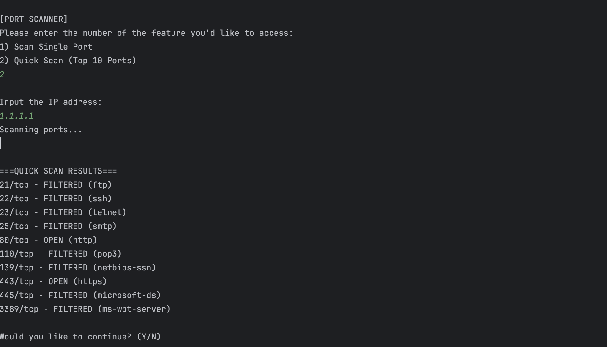

# NetworkChecker 🛠️🌐

**NetworkChecker** is a Python-based network diagnostics and cybersecurity tool I've been building while studying for my A+ and Net+ exams. It allows users to:

- Ping individual or ranges of IP addresses
- Perform quick or targeted port scans using Nmap
- Log detailed system, network, and scan information
- View and log scan results with clean formatting
- Leverage concurrency for fast batch scanning

---

## Features

- ✅ IP Ping Tool with Range Support
- ✅ Port Scanner with Single & Top-Port Modes
- ✅ Local System & Network Info Logging
- ✅ Threaded Concurrent Scanning
- ✅ Regex-based Output Formatting
- ✅ Scan Result Logging (to `net_log.txt`)

---

# Tutorial

Clone this repo to your local machine:
`git clone https://github.com/antohi/NetworkChecker.git`

Install the required Python dependencies:
`pip install -r requirements.txt`

Run the Program
`python network_checker.py`

---
# Screenshots
## Console Output 

IP Ping Output (Single IPs and Range):

Single Port Scans for IP:

Quick Scans (Top 10 Ports in IP):

## Net_Log Output
Net_Log holds program output for future reference and troubleshooting in the form of a txt file

Net_Log Ping Tool Output:

Net_Log Output for Port Scanner

---

# Future ideas: 
- Scan multiple ports and filter by opened
- Traceroute

