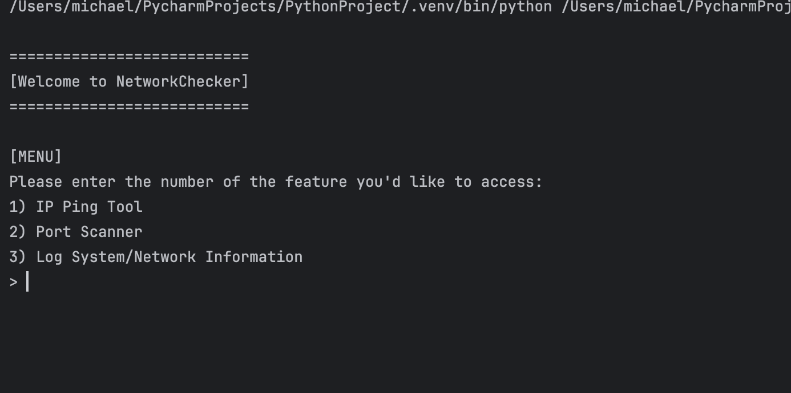
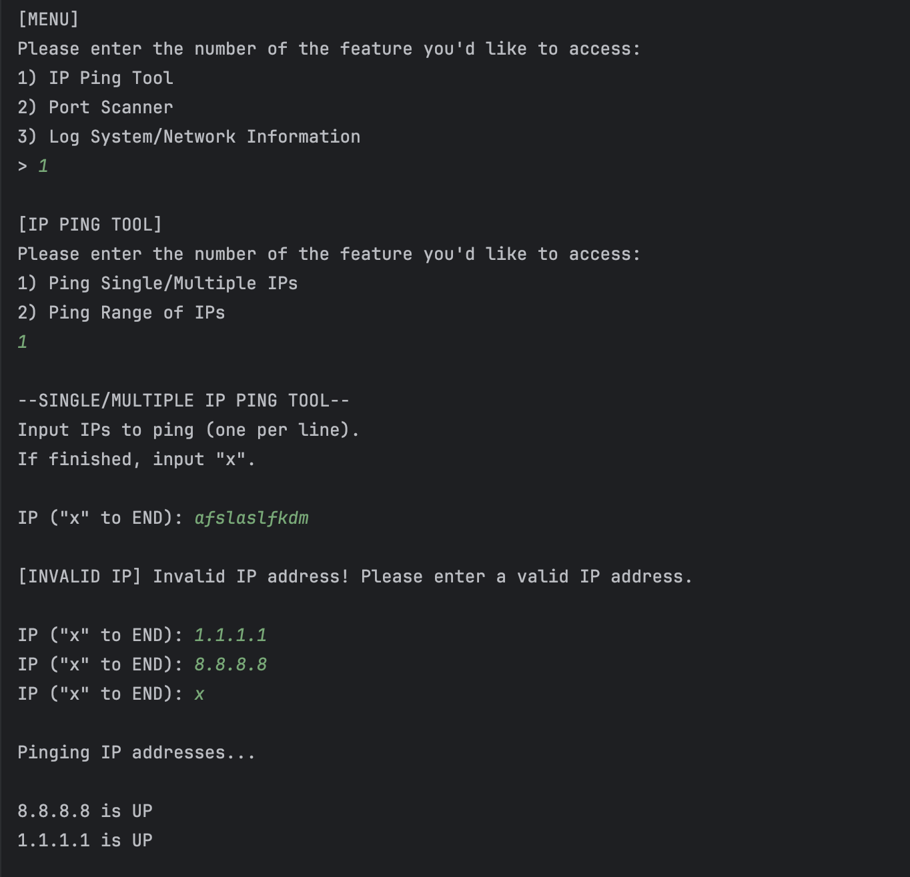
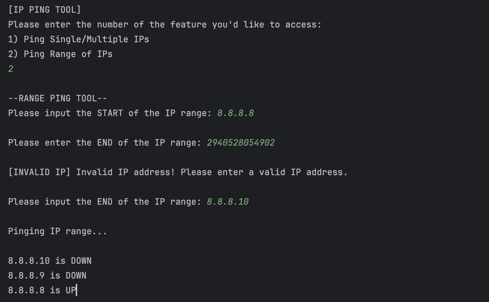
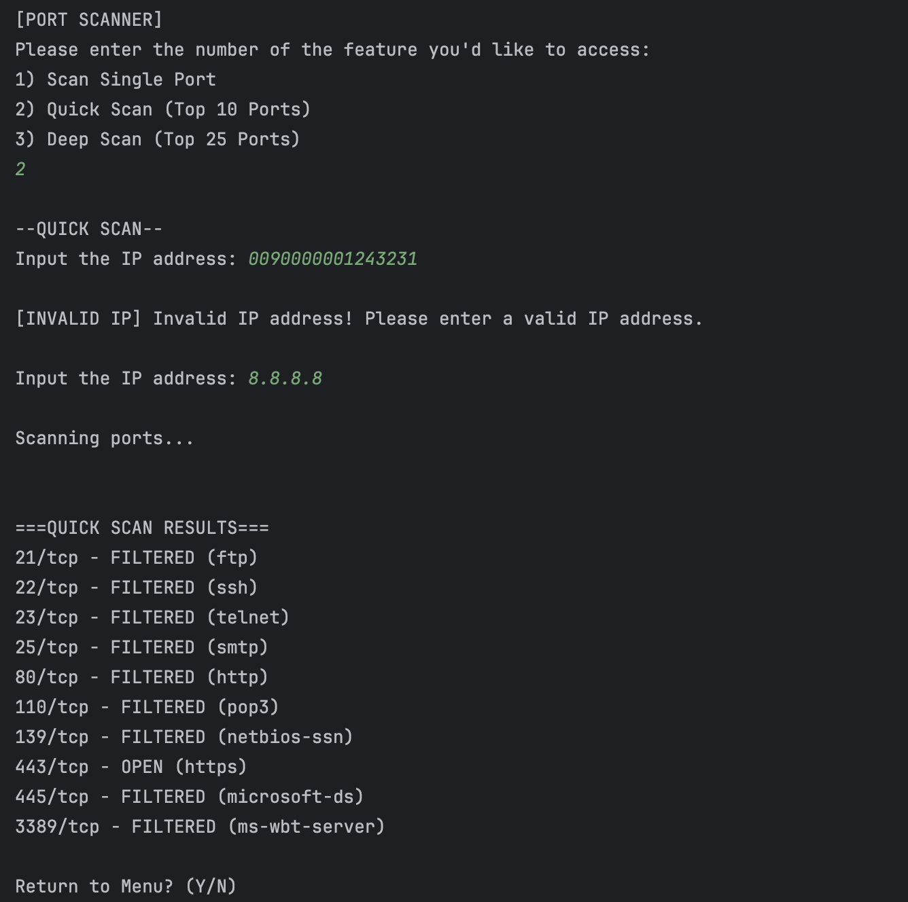
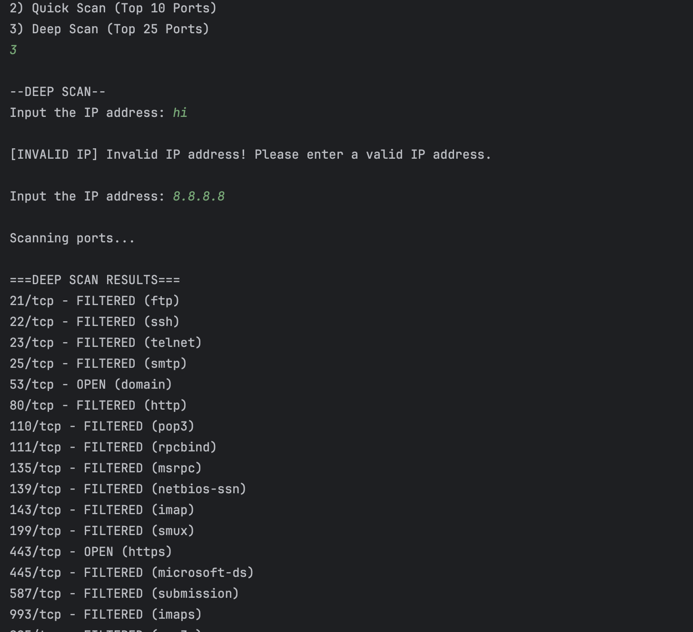
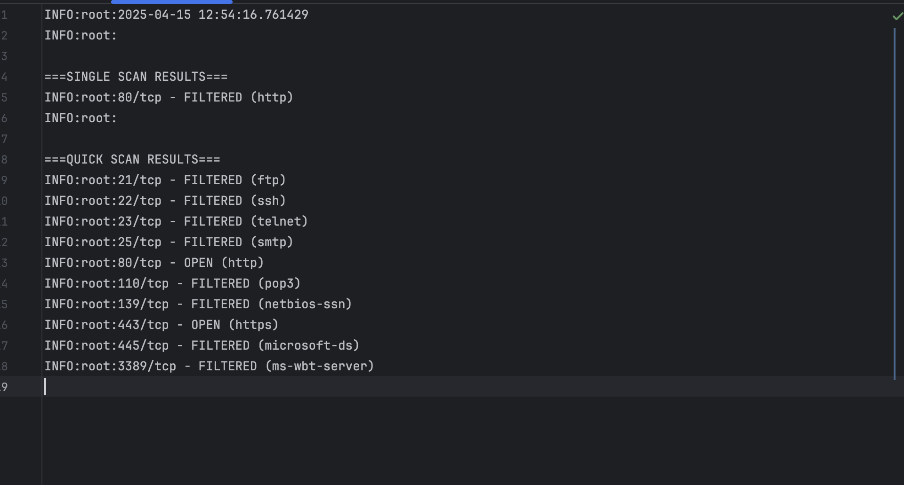

# NetworkChecker 🛠️🌐

**NetworkChecker** is a Python-based network diagnostics and cybersecurity tool I've been building while studying for my A+ and Net+ exams. It allows users to:

- Ping individual or ranges of IP addresses
- Perform quick, targeted, or deep port scans using Nmap
- Log detailed system, network, and scan information
- View and log scan results with clean formatting
- Leverage concurrency for fast batch scanning

---

## Features

- ✅ IP Ping Tool with Range Support
- ✅ Port Scanner with Single & Top-Port Modes
- ✅ Local System & Network Info Logging
- ✅ Threaded Concurrent Scanning
- ✅ Regex-based Output Formatting
- ✅ Scan Result Logging (to `net_log.txt`)
- ✅ IP Validation

---

## Tech Used
- **Networking Tool:** Nmap (via subprocess)
- **Modules:**
  - `subprocess`, `platform`, `os`, `socket`, `re`, `ipaddress`
  - `datetime`, `concurrent.futures`, `logging`
- **Validation:** Custom IP validation using Python’s built-in `ipaddress` module
- **Multithreading:** Handled with `ThreadPoolExecutor`
- **CLI Interface:** Interactive UI with menus

# Tutorial

Clone this repo to your local machine:
`git clone https://github.com/antohi/NetworkChecker.git`

Install the required Python dependencies:
`pip install -r requirements.txt`

Run the Program
`python network_checker.py`

---

# Screenshots (CML UI Output)
## Main Menu:

## Single/Multiple IP Pings:

## Range IP Pings:

## Quick Port Scan (Top 10 Ports in IP):

## Deep Scan (Top 25 Ports in IP):

---

# Screenshots (net_log.txt Output)
## Ping Tool Output (w/ System and Network Info Logging):

## Output for Port Scanner:

---

# Future ideas: 
- Scan multiple ports and filter by opened
- Traceroute

