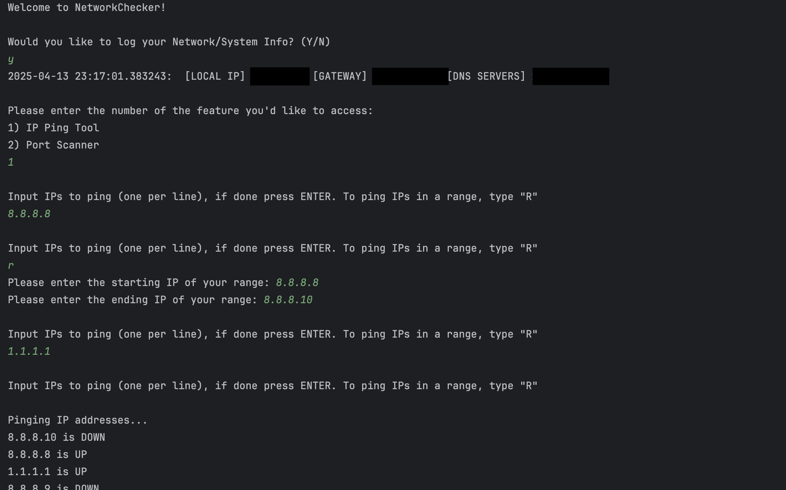
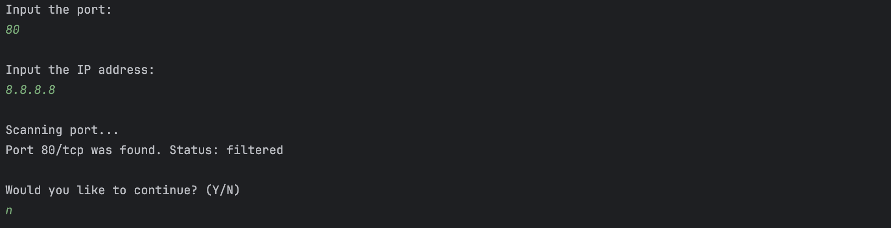
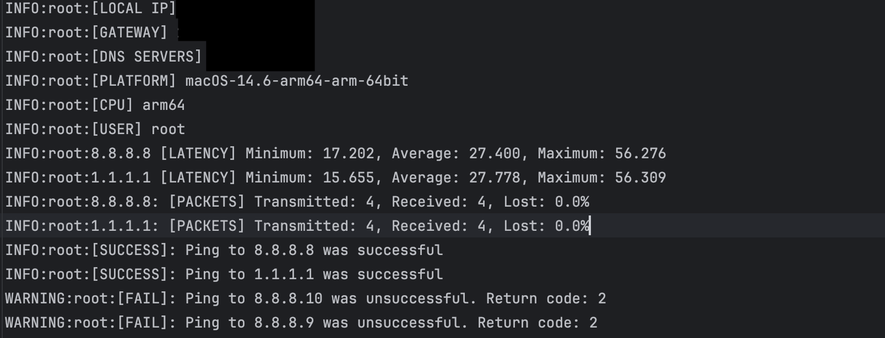
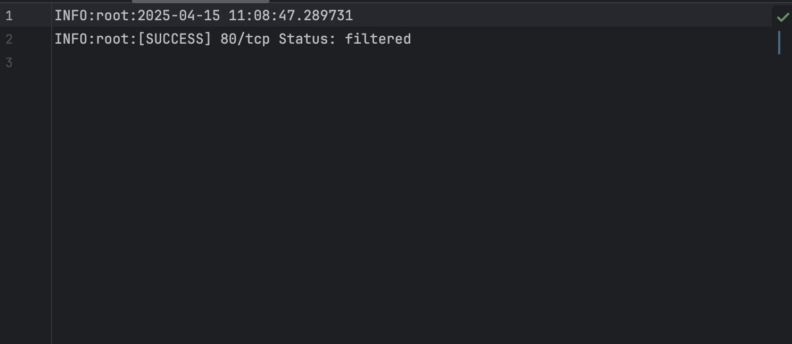

# NetworkChecker

## A Python network diagnostic program that logs local network information and verifies if IP addresses are up or down using console-based pings. Recently added port scanning for single ports to check for possible vulnerabilities. Will upgrade this tool to scan for multiple ports and find opened ones. Built as a learning project while studying for CompTIA A+ and Network+.

# Features

- Retrieves local IP, default gateway, and DNS servers
- Uses concurrent threading to ping multiple IPs simultaneously
- Error handling for file access and ping related exceptions
- Modular design with `NetworkInfo` and `PingTool` classes
- Port Scanning: Scans specific ports on an IP address to check if they are open using Nmap.

# Tutorial

Clone this repo to your local machine:
`git clone https://github.com/antohi/NetworkChecker.git`

Install the required Python dependencies:
`pip install -r requirements.txt`

Run the Program
`python network_checker.py`

# Future ideas: 
- Scan multiple ports and filter by opened
- Traceroute
  
# Terminal Output 
## IP Ping Output (Single IPs and Range)

## Port Scan, Displays Status for Single IPs 

# Net_Log Output
## Net_Log holds program output for future reference and troubleshooting in the form of a txt file

## Net_Log Ping Tool Output:

## Net_Log Output for Port Scanner

